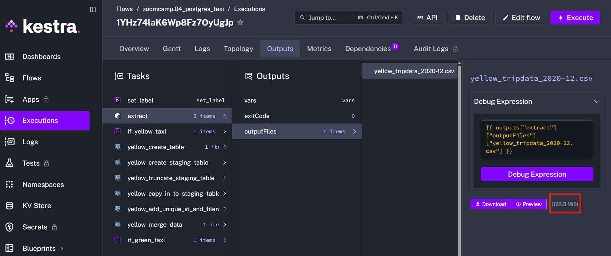

# Module 2 Homework

1) Within the execution for `Yellow` Taxi data for the year `2020` and month `12`: what is the uncompressed file size (i.e. the output file `yellow_tripdata_2020-12.csv` of the `extract` task)?
- 128.3 MiB ✅
- 134.5 MiB
- 364.7 MiB
- 692.6 MiB

In order to find uncompressed file size, in the flow definition [01_postgres_taxi.yaml](flows/01_postgres_taxi.yaml) task responsible for deleting execution files was disabled to allow inspection of the extracted CSV file.

```yaml
- id: purge_files
  type: io.kestra.plugin.core.storage.PurgeCurrentExecutionFiles
  description: To avoid cluttering your storage, we will remove the downloaded files
  desabled: true
```

To see the uncompressed file size in **Kestra UI**, the following steps should be performed:

1. Run the flow.
2. Open the completed execution.
3. Navigate through:
   ```
   Outputs → extract → outputFiles → yellow_tripdata_2020-12.csv
   ```
4. The file size is displayed in the UI, as shown below.




2) What is the rendered value of the variable `file` when the inputs `taxi` is set to `green`, `year` is set to `2020`, and `month` is set to `04` during execution?
- `{{inputs.taxi}}_tripdata_{{inputs.year}}-{{inputs.month}}.csv` 
- `green_tripdata_2020-04.csv` ✅
- `green_tripdata_04_2020.csv`
- `green_tripdata_2020.csv`

The rendered value of the file variable is `green_tripdata_2020-04.csv`, as defined in the YAML configuration below:

```yaml
variables:
  file: "{{inputs.taxi}}_tripdata_{{trigger.date | date('yyyy-MM')}}.csv"
```

3) How many rows are there for the `Yellow` Taxi data for all CSV files in the year 2020?
- 13,537.299
- 24,648,499 ✅
- 18,324,219
- 29,430,127

A new flow file [02_postgres_taxi_all_months.yaml](flows/02_postgres_taxi_all_months.yaml) was added to load all Taxi CSV files for the selected year into the database. After loading the data, the following SQL query was executed to calculate the total number of rows for the year 2020:

```sql
SELECT COUNT(*)
FROM yellow_tripdata
WHERE EXTRACT(YEAR FROM tpep_pickup_datetime) = 2020;
```

4) How many rows are there for the `Green` Taxi data for all CSV files in the year 2020?
- 5,327,301
- 936,199
- 1,734,051 ✅
- 1,342,034

The same flow from the previous task was used to load all Green Taxi CSV files for the selected year into the database.  
After the data was loaded, the following SQL query was executed to calculate the total number of rows for the year 2020:

```sql
SELECT COUNT(*)
FROM green_tripdata
WHERE EXTRACT(YEAR FROM lpep_pickup_datetime) = 2020;
```

5) How many rows are there for the `Yellow` Taxi data for the March 2021 CSV file?
- 1,428,092
- 706,911
- 1,925,152  ✅
- 2,561,031

```sql
SELECT COUNT(*) 
FROM yellow_tripdata 
WHERE EXTRACT(YEAR FROM tpep_pickup_datetime) = 2021
      AND EXTRACT(MONTH FROM tpep_pickup_datetime) = 03;
```

6) How would you configure the timezone to New York in a Schedule trigger?
- Add a `timezone` property set to `EST` in the `Schedule` trigger configuration  
- Add a `timezone` property set to `America/New_York` in the `Schedule` trigger configuration
- Add a `timezone` property set to `UTC-5` in the `Schedule` trigger configuration
- Add a `location` property set to `New_York` in the `Schedule` trigger configuration  
