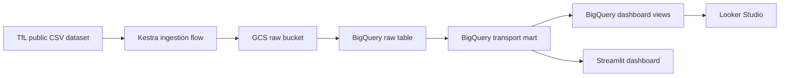

# London Transport Analytics

End-to-end batch analytics pipeline for London public transport usage, built as a DataTalksClub Data Engineering Zoomcamp course project.

## Problem Statement

Public transport demand changes over time because of seasonality, long-term mobility shifts, and external events. Pulling the dataset manually makes it hard to compare trends across transport modes and to keep reporting current.

This project automates the full path from the source dataset to an analytical dashboard:

1. Download the official TfL journeys CSV.
2. Store the raw file in Google Cloud Storage.
3. Load the latest raw snapshot into BigQuery.
4. Transform the wide source table into a partitioned analytical mart.
5. Expose the results through dashboard-ready views and a local Streamlit dashboard.

## Project Status

The repository now covers all required project layers:

- `Cloud + IaC`: Terraform provisions the GCS bucket and BigQuery dataset.
- `Batch orchestration`: Kestra runs the full `source -> lake -> raw -> mart -> dashboard` pipeline.
- `Data warehouse`: raw and mart tables live in BigQuery, with partitioning and clustering on the mart.
- `Transformations`: BigQuery SQL logic is implemented and documented.
- `Dashboard`: two required tiles are available in both BigQuery views and a local Streamlit app.
- `Reproducibility`: Windows-oriented bootstrap, prerequisite checks, and step-by-step run instructions are included.

## Architecture



## Dataset

Source dataset: TfL Public Transport Journeys by Type of Transport

- URL: `https://data.london.gov.uk/dataset/public-transport-journeys-type-transport`
- File used by the pipeline:
  `https://data.london.gov.uk/download/ep8ow/06a805f6-77c6-481a-8b08-ddef56afffdd/tfl-journeys-type.csv`

Main analytical questions:

- How have total public transport journeys changed over time?
- Which transport types contribute the most journeys overall?
- How does the mix of transport modes change across reporting periods?

## Tech Stack

- `GCP`: Google Cloud Storage, BigQuery
- `IaC`: Terraform
- `Orchestration`: Kestra
- `Transformation layer`: BigQuery SQL orchestrated by Kestra
- `Dashboard`: Streamlit and Looker Studio-ready BigQuery views
- `Local automation`: PowerShell scripts

## Repository Structure

```text
london-transport-analytics/
|-- README.md
|-- .gitignore
|-- scripts/
|-- Terraform/
|-- Kestra/
|-- warehouse/
|-- transformations/
|-- dashboard/
```

## Quick Start

### 1. Install Prerequisites

The repository includes Windows helper scripts:

```powershell
.\scripts\bootstrap_windows.ps1 -InstallDocker
.\scripts\check_prereqs.ps1
```

Optional bootstrap flags:

- `-InstallDocker`: installs Docker Desktop as well
- `-InstallDashboardDeps`: creates `.venv` and installs Streamlit dependencies

Notes:

- `Terraform` and `gcloud` were validated locally after installation.
- After `winget` installs, open a new terminal if the commands are not yet in `PATH`.
- Docker Desktop may still require first-run setup, WSL integration, and a restart.

### 2. Configure GCP Infrastructure

Create a working Terraform variable file:

```powershell
cd Terraform
Copy-Item terraform.tfvars.example terraform.tfvars
```

Set your service account path:

```powershell
.\setup.ps1 -CredentialsPath "C:\path\to\service-account.json"
```

Deploy:

```powershell
.\deploy.ps1
```

The Terraform configuration was locally validated with:

```powershell
terraform init -backend=false
terraform validate
```

### 3. Start Kestra

```powershell
cd ..\Kestra
docker compose up
```

Open `http://localhost:8080`.

Default local credentials:

- Username: `admin@localhost.dev`
- Password: `kestra`

The `docker-compose.yml` file now auto-loads the project flow YAML files at startup, so you no longer need to import them one by one for local development.

### 4. Configure Kestra

Before running the pipeline:

1. Create the secret `GCP_SERVICE_ACCOUNT` with the full JSON content of your service account.
2. Run the `set_kv` flow to initialize the default KV pairs.
3. Adjust KV values if you changed bucket, project, dataset, or table names.

### 5. Run the End-to-End Pipeline

Run the `end_to_end_pipeline` flow in the `london_transport` namespace.

The flow executes:

1. `data_load_gcs`
2. `gcs_to_bigquery_raw`
3. `build_mart_bigquery`
4. `build_dashboard_views_bigquery`

## Dashboard Options

### Option A: Local Streamlit Dashboard

From the repository root, run:

```powershell
.\scripts\run_dashboard.ps1
```

The Streamlit app supports two modes:

- `BigQuery mart`: reads `transport_journeys_mart` from your GCP project
- `Public CSV fallback`: downloads the official TfL CSV and applies the same mart logic locally

Environment variables used by the BigQuery mode:

- `LTA_BQ_PROJECT_ID`
- `LTA_BQ_DATASET` (default: `london_transport_dw`)
- `LTA_BQ_MART_TABLE` (default: `transport_journeys_mart`)
- `GOOGLE_APPLICATION_CREDENTIALS`

### Option B: Looker Studio

If you prefer a hosted BI layer, connect Looker Studio to these BigQuery views:

- `transport_journeys_over_time_v`
- `transport_type_distribution_v`

The SQL definition for the two views is in [dashboard/create_dashboard_views.sql](dashboard/create_dashboard_views.sql).

## Module Guide

- [Terraform/README.md](Terraform/README.md): infrastructure provisioning
- [Kestra/README.md](Kestra/README.md): orchestration, flow descriptions, and local startup
- [warehouse/README.md](warehouse/README.md): raw table design
- [transformations/README.md](transformations/README.md): mart logic and manual SQL
- [dashboard/README.md](dashboard/README.md): Streamlit dashboard and BigQuery view usage

## Validation Notes

Completed locally on March 29, 2026:

- `Terraform` installed via `winget`
- `Google Cloud SDK` installed via `winget`
- `terraform init -backend=false`
- `terraform validate`

Not completed locally in this environment:

- `Docker Desktop` installation and Kestra runtime verification
- actual GCP execution of the pipeline
- publication of an online Looker Studio report

## Project Improvement Opportunities

- Migrate transformations to `dbt` if you want the transformation layer to score as a framework-based transformation stage in the Zoomcamp rubric.
- Add automated tests around the mart logic.
- Add CI to validate Terraform formatting, Python syntax, and dashboard startup.
